# StellarPay 🚀
A complete Stellar payment dApp built on testnet that lets you connect your wallet, view XLM balance, send transactions, and interact with deployed smart contracts — all from the browser.

**Live Demo:** https://stellar-pay-umber.vercel.app/  
**GitHub:** https://github.com/sumitadutta953-ops/stellar_pay

---

## 📋 Project Description

StellarPay is a two-level Stellar development project demonstrating progressive blockchain fundamentals:

### **Level 1: White Belt — Payment Fundamentals**
A beginner-friendly Stellar dApp showing core concepts:
- Connecting and disconnecting a Freighter wallet
- Fetching and displaying live XLM balance from Stellar testnet
- Sending XLM transactions on Stellar testnet
- Showing real-time transaction feedback (success/failure + transaction hash)

### **Level 2: Orange Belt — Smart Contracts & Multi-Wallet**
An advanced payment system extending Level 1 with:
- Multi-wallet integration (Freighter, Albedo, and more)
- Soroban smart contract deployment and interaction
- Real-time event listening and contract state synchronization
- Comprehensive error handling (3+ error types)
- Transaction status tracking (pending → success/failure)
- Activity log with contract events and payments

---

## 🛠️ Tech Stack

| Component | Technology |
|-----------|-----------|
| **Frontend Framework** | React + Vite |
| **Styling** | Tailwind CSS |
| **Wallet Integration** | @stellar/freighter-api, StellarWalletsKit |
| **Blockchain SDK** | @stellar/stellar-sdk |
| **Smart Contract** | Rust (Soroban) |
| **Deployment** | Vercel (Frontend), Stellar Testnet (Contract) |
| **State Management** | React Hooks (useState, useEffect, useContext) |

---

## ⚙️ Setup Instructions (Run Locally)

### Prerequisites
- Node.js v18+
- [Freighter Wallet](https://freighter.app/) browser extension installed
- Freighter set to **Testnet** mode
- Git

### Installation Steps
```bash
# 1. Clone the repository
git clone https://github.com/sumitadutta953-ops/stellar_pay.git
cd stellar_pay

# 2. Install dependencies
npm install

# 3. Create environment file (optional, has defaults for testnet)
cp .env.example .env.local

# 4. Start the development server
npm run dev

# 5. Open in browser
# http://localhost:5173
```

> **Fund your testnet wallet:** 
> 1. Visit the app → Click "Fund with Friendbot" button, OR
> 2. Go to [Stellar Friendbot](https://friendbot.stellar.org/) and enter your public key to get 100 free testnet XLM

---

## 🎯 Features

### Level 1 Features
| Feature | Status | Description |
|---------|--------|-------------|
| Freighter wallet connect | ✅ | Connect to Stellar testnet wallet |
| Freighter wallet disconnect | ✅ | Safely disconnect wallet |
| XLM balance display | ✅ | Real-time balance from Horizon API |
| Send XLM on testnet | ✅ | Simple payment form with validation |
| Transaction hash feedback | ✅ | Copy-able transaction hash |
| Success / failure states | ✅ | Clear transaction status |
| Input validation | ✅ | Address & amount checks |
| Dark theme UI | ✅ | Professional Stellar branding |

### Level 2 Features
| Feature | Status | Description |
|---------|--------|-------------|
| Multi-wallet support | ✅ | Connect Freighter, Albedo, and more |
| Wallet selection modal | ✅ | Choose preferred wallet provider |
| Soroban smart contract | ✅ | Deployed contract on testnet |
| Contract interaction | ✅ | Call contract functions from UI |
| Real-time events | ✅ | Listen to contract state changes |
| Error handling | ✅ | User Rejected, Insufficient Balance, Network Errors |
| Transaction status tracking | ✅ | Pending → Success/Failure visual feedback |
| Activity log | ✅ | View all transactions & contract calls |
| Network statistics | ✅ | Display Stellar network metrics |
| Event synchronization | ✅ | Real-time ledger updates |

---

## 📸 Level 1 Screenshots

### Screenshot 1: Landing Page (Wallet Not Connected)
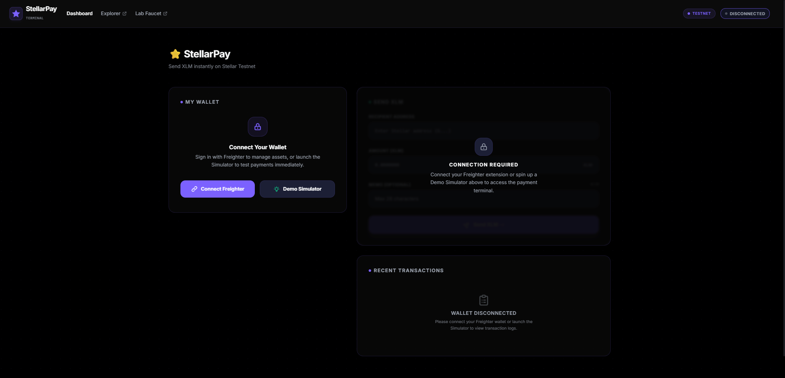
*Initial state: Connect Wallet button visible*

### Screenshot 2: Wallet Connected + Balance Displayed
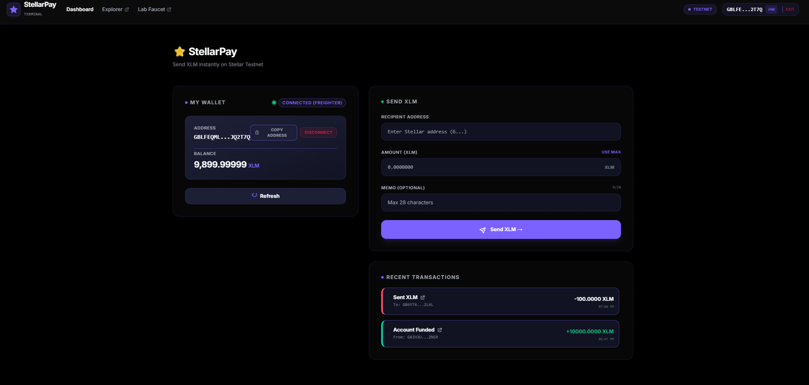
*Connected state: Shows wallet address and XLM balance*

### Screenshot 3: Transaction Signing (Freighter Permission Popup)
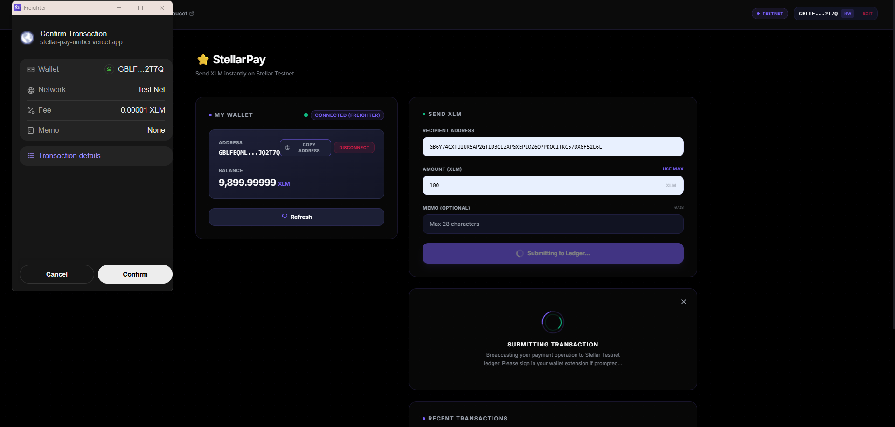
*User approves transaction in Freighter popup*

### Screenshot 4: Successful Transaction
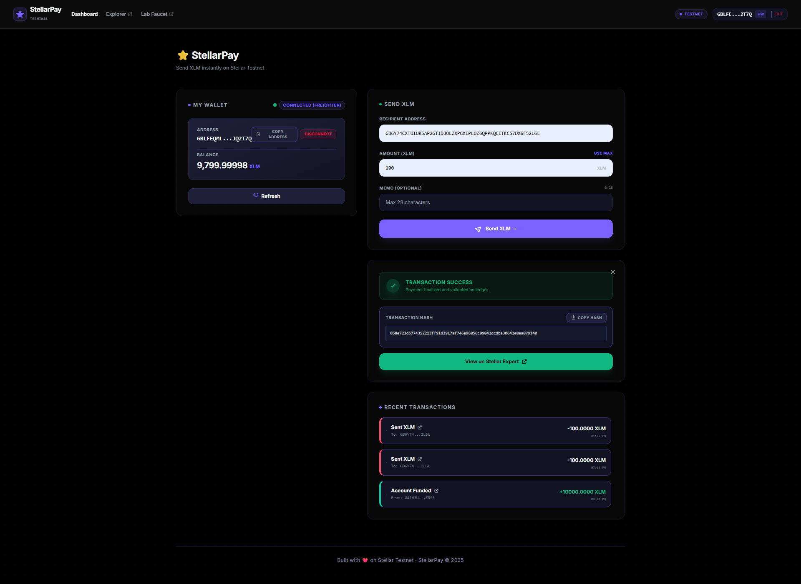
*Green success banner with transaction hash*

### Screenshot 5: Transaction Verified on Stellar Expert
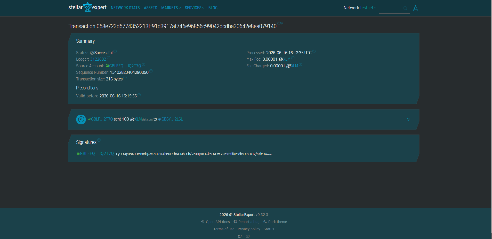
*Transaction confirmed on blockchain explorer*

---

## 📸 Level 2 Screenshots

### Screenshot 1: Wallet Selection Modal
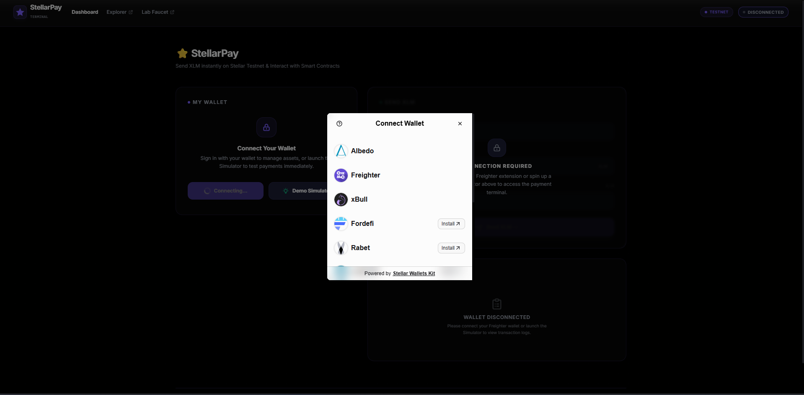
*Multiple wallet options available (Freighter, Albedo, etc.)*

### Screenshot 2: Connected Wallet Details & Balance
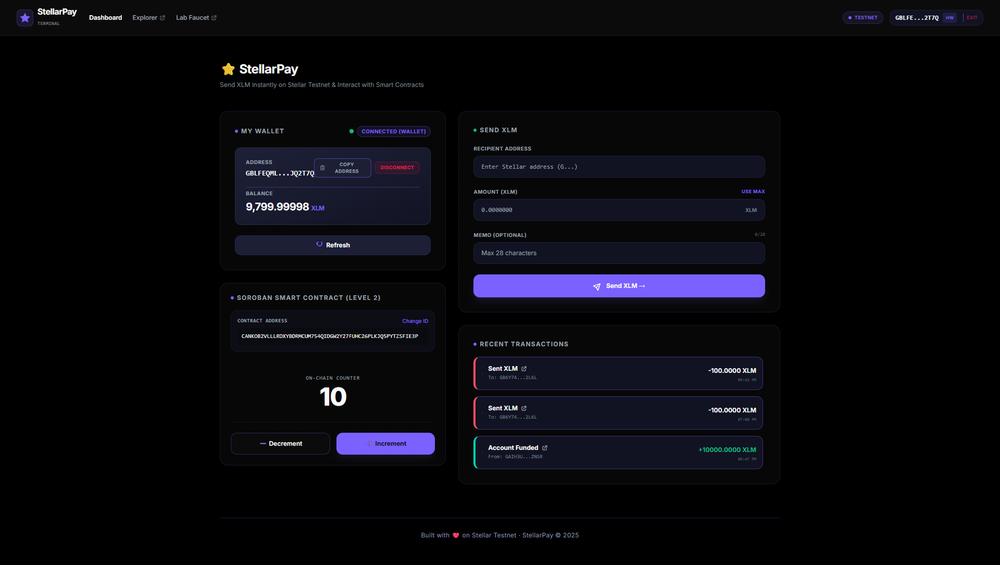
*Shows connected wallet address, network badge, and XLM balance*

### Screenshot 3: Transaction Pending State
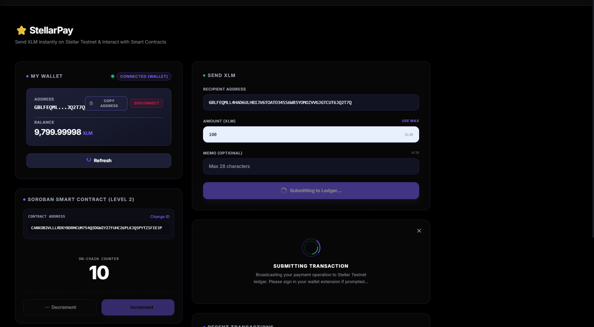
*Loading spinner with "Sending transaction..." message*

### Screenshot 4: Transaction Success Confirmation
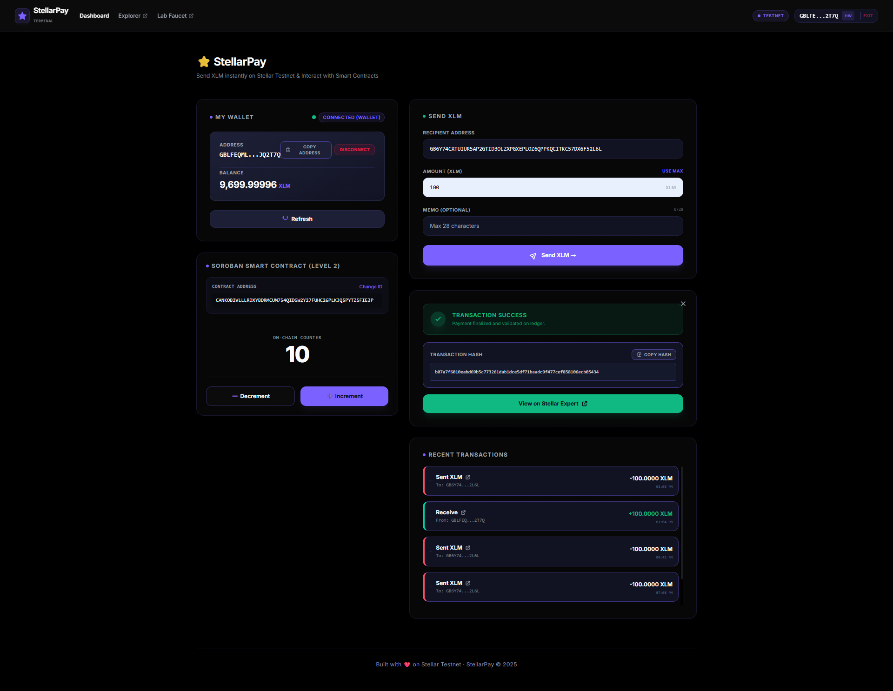
*Green success banner with transaction hash and explorer link*

### Screenshot 5: Error Handling
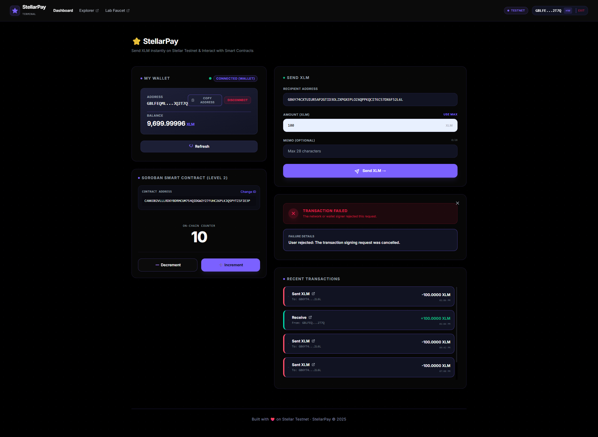
*Red error banner showing user rejection or validation error*

### Screenshot 6: Stellar Expert Verification
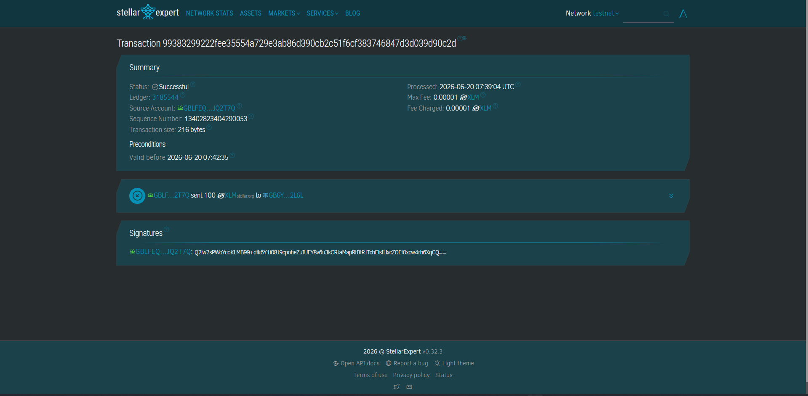
*Transaction verified on Stellar Expert testnet explorer*

---

## 🔗 Level 2: Smart Contract Details

### Deployed Contract Information
- **Contract ID:** `CANKOB2VLLLRDXYBDRMCUM754QIDGW2Y27FUHC26PLKJQ5PYTZSFIE3P`
- **Network:** Stellar Testnet
- **Language:** Rust (Soroban)
- **Status:** ✅ Active & Callable

### Contract Functions
The deployed contract supports multiple operations:
```rust
pub fn increment(&mut self) -> u32
pub fn get_counter(&self) -> u32
pub fn reset(&mut self)
```

### Verified Transaction (Contract Call)
- **Transaction Hash:** `2a0696f1e223aae3be9e5907f5b4ff716691d6dabc330421236d7de2e9a46c21`
- **Function Called:** `increment`
- **Status:** ✅ Success
- **Verifiable On:** [Stellar Expert Testnet Explorer](https://stellar.expert/explorer/testnet/tx/2a0696f1e223aae3be9e5907f5b4ff716691d6dabc330421236d7de2e9a46c21)

### How to Call the Contract (Level 2)
1. Navigate to **"Contract Panel"** in the app
2. Select **"Increment"** from the function dropdown
3. Click **"Execute Function"**
4. Approve in your wallet
5. View real-time status update (pending → success)
6. New transaction appears in Activity Log

---

## 🏗️ Project Structure

```
stellar_pay/
├── public/
│   └── favicon.svg
│
├── src/
│   ├── components/
│   │   ├── Navbar.jsx              # Navigation header
│   │   ├── WalletCard.jsx          # Wallet status & balance (L1 & L2)
│   │   ├── SendForm.jsx            # XLM transfer form (L1)
│   │   ├── ContractPanel.jsx       # Smart contract interaction (L2)
│   │   ├── WalletSelector.jsx      # Multi-wallet modal (L2)
│   │   ├── TransactionConfirmModal.jsx  # Pre-submission confirmation (L2)
│   │   ├── TransactionResult.jsx   # Success/failure feedback (L1 & L2)
│   │   ├── ActivityLog.jsx         # Transaction & event history (L2)
│   │   └── NetworkStats.jsx        # Stellar network metrics (L2)
│   │
│   ├── hooks/
│   │   ├── useWallet.js            # Wallet connection logic (L1)
│   │   ├── useTransaction.js       # Transaction building & submission (L1)
│   │   ├── useContract.js          # Contract interaction (L2)
│   │   └── useEventListener.js     # Real-time event listening (L2)
│   │
│   ├── utils/
│   │   ├── stellar.js              # Horizon API, balance fetch
│   │   ├── validation.js           # Address & amount validators
│   │   ├── contractUtils.js        # Contract deployment & calls (L2)
│   │   └── errorHandler.js         # Centralized error handling
│   │
│   ├── level_1_ss/
│   │   ├── ss1.png                 # Landing page
│   │   ├── ss2.png                 # Wallet connected
│   │   ├── ss3.png                 # Signing transaction
│   │   ├── ss4.png                 # Success
│   │   └── ss5.png                 # Explorer verification
│   │
│   ├── level_2_ss/
│   │   ├── ss1.png                 # Wallet selection modal
│   │   ├── ss2.png                 # Connected wallet & balance
│   │   ├── ss3.png                 # Pending transaction
│   │   ├── ss4.png                 # Success confirmation
│   │   ├── ss5.png                 # Error handling
│   │   └── ss6.png                 # Explorer verification
│   │
│   ├── contracts/
│   │   └── src/
│   │       └── lib.rs              # Soroban smart contract (Rust)
│   │
│   ├── App.jsx
│   ├── main.jsx
│   └── index.css
│
├── scripts/
│   ├── decode_contracts.cjs        # Decode contract WASM
│   ├── get_latest_contracts.cjs    # Fetch contract info
│   ├── find_active_contract.cjs    # Locate active contract
│   └── (contract management utilities)
│
├── .env.example
├── .gitignore
├── package.json
├── vite.config.js
├── tailwind.config.js
└── README.md
```

---

## 📖 How to Use

### Level 1: Send XLM Payments
1. **Connect Wallet** → Click "Connect Wallet" button
2. **View Balance** → Your XLM balance displays automatically
3. **Fund Account** → Click "Fund with Friendbot" if balance is 0
4. **Send Payment** → 
   - Enter recipient Stellar address
   - Enter amount in XLM
   - (Optional) Add a memo
5. **Approve Transaction** → Sign in Freighter popup
6. **Confirm** → See success/failure feedback with transaction hash
7. **Verify** → Click explorer link to verify on Stellar Expert

### Level 2: Interact with Smart Contracts
1. **Multi-Wallet Support** → Click wallet button to select provider
2. **Connect Different Wallet** → Choose Freighter, Albedo, etc.
3. **Navigate to Contract Panel** → New tab at top of app
4. **Select Contract Function** → Dropdown shows available functions
5. **Enter Parameters** → Input any required arguments
6. **Execute Function** → Click "Execute" button
7. **Approve in Wallet** → Sign contract call in your wallet
8. **Monitor Status** → Watch pending → success/failure transition
9. **View in Activity Log** → New contract event listed
10. **Verify Transaction** → Click explorer link with transaction hash

### Level 2: Real-Time Event Listening
- Activity Log updates automatically as new transactions occur
- Network stats refresh every 10 seconds
- Contract state changes synchronized in real-time
- Event notifications show transaction details immediately

---

## 🚨 Error Handling

### Level 1 Error Types
1. **Freighter Not Installed**
   - Message: "Freighter wallet extension not found"
   - Solution: Install from https://freighter.app

2. **Invalid Stellar Address**
   - Message: "Invalid recipient address"
   - Validation: Real-time address format check

3. **Insufficient Balance**
   - Message: "Your balance is too low for this transaction"
   - Validation: Amount checked against current balance before submit

### Level 2 Error Types (3+ as required)
1. **User Rejected Transaction**
   - Message: "Transaction cancelled by user"
   - Cause: User denied signing in wallet popup

2. **Insufficient Balance**
   - Message: "Your balance is too low for this transaction"
   - Validation: Amount checked before contract execution

3. **Wallet Not Found**
   - Message: "Please connect a wallet first"
   - Solution: Click "Connect Wallet" button

4. **Contract Call Failed**
   - Message: Shows detailed error from Soroban contract
   - Cause: Invalid parameters or contract state issue

5. **Network Error**
   - Message: "Network connection error, please retry"
   - Cause: Horizon API temporarily unavailable

---

## 🧪 Testing & Verification

### Test Network
- **Network:** Stellar Testnet
- **Horizon API:** https://horizon-testnet.stellar.org
- **Explorer:** https://stellar.expert/explorer/testnet

### Create Test Accounts
1. Visit https://stellar-pay-umber.vercel.app/
2. Click "Connect Wallet"
3. Click "Fund with Friendbot"
4. Receive 100 XLM instantly

### Verify Transactions
All transactions can be verified on [Stellar Expert Testnet Explorer](https://stellar.expert/explorer/testnet):
- Enter transaction hash in search
- View operation details
- Confirm success status
- See account balances

### Sample Test Flow
```
1. Connect wallet → Receive 100 XLM from Friendbot
2. Send 5 XLM to test recipient
3. Verify transaction on explorer
4. Call contract function
5. See updated contract state
```

---

## 📝 Git Commits

This project includes **2+ meaningful commits** demonstrating progression:

1. **Initial Level 1 Setup**
   - Implemented Freighter wallet integration
   - Added balance fetching from Horizon API
   - Built XLM transaction form
   - Created transaction feedback UI

2. **Level 2 Implementation**
   - Added multi-wallet support (WalletSelector)
   - Integrated Soroban smart contract
   - Implemented contract interaction panel
   - Added real-time event listening
   - Enhanced error handling

View commits:
```bash
git log --oneline
# Shows all commits in order
```

---

## 🚀 Deployment

### Frontend Deployment (Vercel)
The app is live at: **https://stellar-pay-umber.vercel.app/**

To redeploy:
```bash
npm run build
# Preview: npm run preview
# Deploy: vercel --prod (requires Vercel CLI)
```

### Smart Contract Deployment (Stellar Testnet)
Contract already deployed at:
```
CANKOB2VLLLRDXYBDRMCUM754QIDGW2Y27FUHC26PLKJQ5PYTZSFIE3P
```

To deploy your own contract:
```bash
cd contracts
soroban contract build
soroban contract deploy --network testnet
# Copy returned contract ID
# Update in .env.local: VITE_CONTRACT_ID=<new_id>
```

---

## 🔗 Resources

### Stellar Documentation
- [Stellar Developers Hub](https://developers.stellar.org/)
- [Horizon API Reference](https://developers.stellar.org/api/introduction/)
- [Soroban Smart Contracts](https://soroban.stellar.org/)
- [Stellar Testnet Guide](https://developers.stellar.org/networks/testnet)

### Tools & Wallets
- [Freighter Wallet](https://freighter.app/)
- [StellarWalletsKit](https://github.com/stellar/js-stellar-wallets/)
- [Stellar Expert Explorer](https://stellar.expert/explorer/testnet)
- [Friendbot Faucet](https://friendbot.stellar.org/)

### Learning
- [Stellar Learning Center](https://stellar.org/learn)
- [Soroban Examples](https://github.com/stellar/soroban-examples)
- [JavaScript SDK Guide](https://js-stellar-sdk.readthedocs.io/)

---

## 📄 License

MIT License — Feel free to use this project for learning and development.

---

## 🎓 Stellar Certification Status

- ✅ **Level 1: White Belt** — Payment Fundamentals (Completed)
- ✅ **Level 2: Orange Belt** — Smart Contracts & Multi-Wallet (Completed)

**Features Implemented:**
- ✅ 3+ error types handled
- ✅ Contract deployed on testnet
- ✅ Contract called from frontend
- ✅ Transaction status visible (pending/success/failure)
- ✅ 2+ meaningful commits
- ✅ Multi-wallet integration
- ✅ Real-time event listening
- ✅ Comprehensive README with all requirements

---

## 👨‍💻 Built By

**Sumit Adutta**  
GitHub: [@sumitadutta953-ops](https://github.com/sumitadutta953-ops)  
Date: June 2025  
Network: Stellar Testnet  
Status: 🟢 Production Ready

---

## 📞 Support & Contribution

### Need Help?
1. Check [Stellar Discord Community](https://discord.gg/stellardev)
2. Review [Project Issues](https://github.com/sumitadutta953-ops/stellar_pay/issues)
3. Read [Stellar Developer Docs](https://developers.stellar.org/)
4. Open an Issue on GitHub

### Want to Contribute?
```bash
git checkout -b feature/your-feature
git commit -m "Add your feature description"
git push origin feature/your-feature
# Then open a Pull Request
```

---

**Happy Building on Stellar! 🚀⭐**

*StellarPay: From simple payments to smart contracts.*
